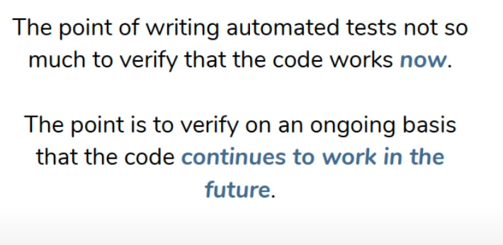

#### What is testing?



#### Test life cycle


#### @TestInstance


#### @DisplayName


#### @Disabled

for the method that is not written yet, so disable the test for this method.


#### @EnabledOnOs(Os.LINUX)

for certain operating system


#### Assumptions.assumeTrue()

### Grouping

#### assertAll()


#### @Nested


#### @REpeatedTest(3)

#### @Tag

```console
mvn test
```

for maven run certain test with the same tag name


